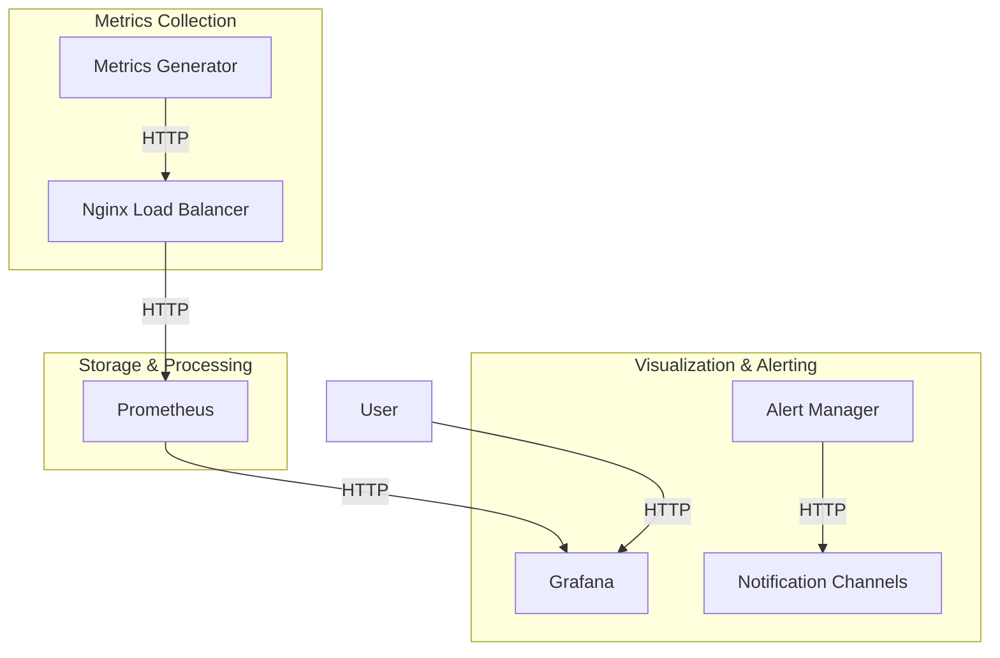
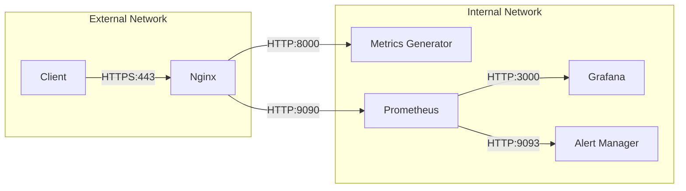

# Nessi Monitoring System Architecture

## System Overview

The Nessi Monitoring System is a comprehensive solution for monitoring and analyzing database performance, data quality, and system health. The system consists of several components working together to provide real-time insights and alerts.

## Component Architecture

## Component Details

### 1. Metrics Generator
- **Purpose**: Generates test metrics simulating various operational scenarios
- **Features**:
  - Basic authentication
  - Health check endpoint
  - Multiple metric types (Gauge, Counter, Histogram)
  - Configurable scenarios
- **Security**: Basic authentication, rate limiting via Nginx

### 2. Nginx Load Balancer
- **Purpose**: Distributes traffic and provides security
- **Features**:
  - Load balancing
  - Rate limiting
  - Basic authentication
  - SSL termination (when configured)
  - Security headers
- **Security**: Rate limiting, authentication, security headers

### 3. Prometheus
- **Purpose**: Time series database and alerting
- **Features**:
  - Metrics collection
  - Alert rule evaluation
  - Data storage
  - Service discovery
- **Security**: Basic authentication, network isolation

### 4. Grafana
- **Purpose**: Visualization and dashboarding
- **Features**:
  - Custom dashboards
  - Alert visualization
  - User management
  - Data source integration
- **Security**: User authentication, role-based access

### 5. Alert Manager
- **Purpose**: Alert routing and notification
- **Features**:
  - Alert deduplication
  - Notification routing
  - Silence management
- **Security**: Network isolation, authentication

## Network Architecture

## Security Architecture

### Authentication & Authorization
1. **Metrics Endpoint**
   - Basic authentication
   - Rate limiting
   - IP whitelisting (optional)

2. **Grafana**
   - User authentication
   - Role-based access control
   - Session management

3. **Prometheus**
   - Basic authentication
   - Network isolation
   - TLS encryption (optional)

### Network Security
1. **Firewall Rules**
   - Ingress: 443 (HTTPS), 3000 (Grafana)
   - Egress: Limited to necessary services

2. **Network Segmentation**
   - External-facing services
   - Internal monitoring services
   - Alert management services

## Scalability Architecture

### Horizontal Scaling
1. **Metrics Generator**
   - Multiple instances behind load balancer
   - Stateless design
   - Shared configuration

2. **Prometheus**
   - Federation for global view
   - Remote write for long-term storage
   - Sharding for large deployments

3. **Grafana**
   - Multiple instances
   - Shared database
   - Load balanced access

### Resource Management
1. **Container Resources**
   - CPU limits and requests
   - Memory limits and requests
   - Health checks

2. **Storage**
   - Persistent volumes
   - Backup strategies
   - Retention policies

## Monitoring Architecture

### Health Checks
1. **Service Level**
   - HTTP health endpoints
   - Container health checks
   - Service dependencies

2. **Resource Level**
   - CPU usage
   - Memory usage
   - Disk usage
   - Network metrics

### Alerting
1. **Service Alerts**
   - Service availability
   - Error rates
   - Latency thresholds

2. **Resource Alerts**
   - Resource utilization
   - Capacity planning
   - Performance degradation

## Deployment Architecture

### Container Orchestration
1. **Docker Compose**
   - Service definitions
   - Network configuration
   - Volume management
   - Environment variables

2. **Kubernetes (Optional)**
   - Deployment manifests
   - Service definitions
   - Ingress configuration
   - Resource management

### Configuration Management
1. **Environment Variables**
   - Service configuration
   - Security settings
   - Feature flags

2. **Configuration Files**
   - Prometheus rules
   - Grafana dashboards
   - Alert configurations
   - Nginx settings 