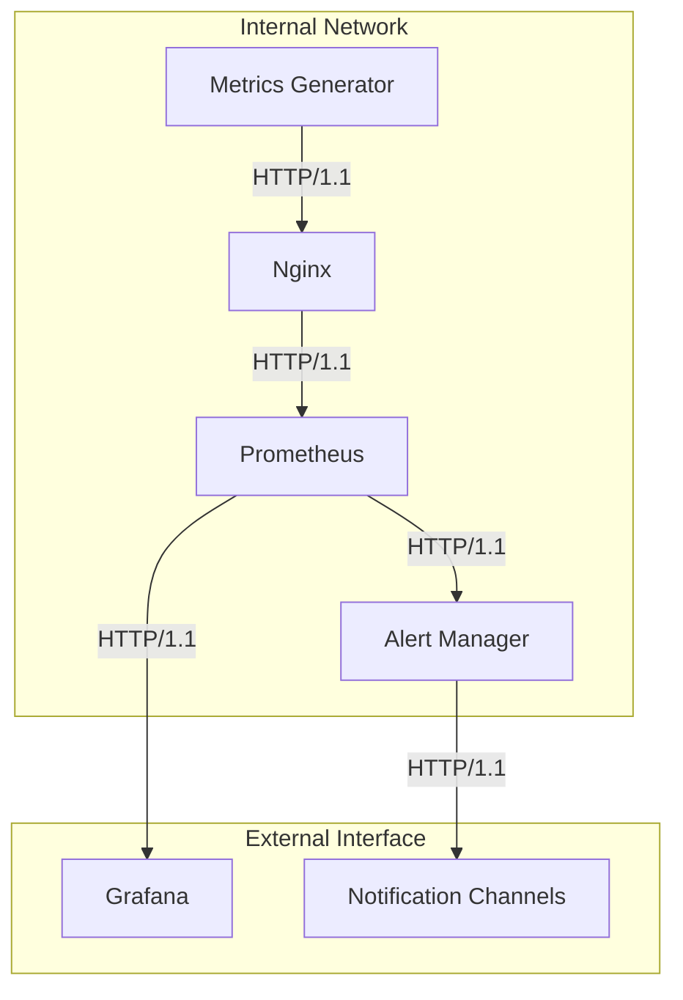

# nessi.dev Monitoring System Communication Protocols

## Overview

This document details the communication protocols and interfaces between different components of the nessi.dev Monitoring System. Each component communicates using specific protocols and data formats to ensure reliable and secure data exchange.

## Component Communication Map



## Protocol Details

### 1. Metrics Generator to Nginx

**Protocol**: HTTP/1.1
**Port**: 8000
**Authentication**: Required
**Rate Limiting**: Enabled

#### Request Format
```http
GET /metrics HTTP/1.1
Host: metrics-test:8000
Authorization: <credentials>
User-Agent: Prometheus/2.45.0
Accept: text/plain
```

#### Response Format
```plaintext
# HELP metric_name metric_description
# TYPE metric_name metric_type
metric_name{label="value"} metric_value
```

#### Health Check
```http
GET /health HTTP/1.1
Host: metrics-test:8000

Response:
{
    "status": "healthy"
}
```

### 2. Nginx to Prometheus

**Protocol**: HTTP/1.1
**Port**: 8001
**Authentication**: Required
**Rate Limiting**: Enabled

#### Request Format
```http
GET /metrics HTTP/1.1
Host: localhost:8001
Authorization: <credentials>
User-Agent: Prometheus/2.45.0
Accept: text/plain
```

#### Response Headers
```http
HTTP/1.1 200 OK
Server: nginx/1.25.3
Content-Type: text/plain
X-Frame-Options: SAMEORIGIN
X-XSS-Protection: 1; mode=block
X-Content-Type-Options: nosniff
```

### 3. Prometheus to Grafana

**Protocol**: HTTP/1.1
**Port**: 9090
**Authentication**: Internal network only

#### Query API
```http
GET /api/v1/query?query=metric_name HTTP/1.1
Host: prometheus:9090

Response:
{
    "status": "success",
    "data": {
        "resultType": "vector",
        "result": [
            {
                "metric": {
                    "label": "value"
                },
                "value": [timestamp, "metric_value"]
            }
        ]
    }
}
```

#### Range Query API
```http
GET /api/v1/query_range?query=metric_name&start=timestamp&end=timestamp&step=interval HTTP/1.1
Host: prometheus:9090
```

### 4. Prometheus to Alert Manager

**Protocol**: HTTP/1.1
**Port**: 9093
**Authentication**: Internal network only

#### Alert Format
```json
{
    "status": "firing",
    "labels": {
        "alertname": "HighErrorRate",
        "severity": "critical",
        "instance": "metrics-test:8000"
    },
    "annotations": {
        "description": "Error rate is above threshold",
        "summary": "High error rate detected"
    },
    "startsAt": "2024-03-20T10:00:00Z",
    "endsAt": "2024-03-20T10:05:00Z"
}
```

### 5. Alert Manager to Notification Channels

**Protocol**: HTTP/1.1
**Port**: 9093
**Authentication**: Required

#### Webhook Format
```json
{
    "receiver": "webhook",
    "status": "firing",
    "alerts": [
        {
            "status": "firing",
            "labels": {
                "alertname": "HighErrorRate",
                "severity": "critical"
            },
            "annotations": {
                "description": "Error rate is above threshold"
            },
            "startsAt": "2024-03-20T10:00:00Z",
            "endsAt": "2024-03-20T10:05:00Z"
        }
    ]
}
```

## Data Formats

### 1. Metrics Format

```plaintext
# HELP metric_name metric_description
# TYPE metric_name metric_type
metric_name{label1="value1",label2="value2"} metric_value timestamp
```

Supported metric types:
- `counter`: Monotonically increasing counter
- `gauge`: Arbitrary value that can go up or down
- `histogram`: Samples observations into configurable buckets
- `summary`: Similar to histogram but for quantiles

### 2. Alert Rules Format

```yaml
groups:
- name: example
  rules:
  - alert: HighErrorRate
    expr: rate(errors_total[5m]) > 0.1
    for: 5m
    labels:
      severity: critical
    annotations:
      summary: High error rate detected
      description: Error rate is {{ $value }} errors per second
```

### 3. Dashboard Configuration Format

```json
{
    "dashboard": {
        "title": "nessi.dev Monitoring",
        "panels": [
            {
                "title": "Error Rate",
                "type": "graph",
                "datasource": "Prometheus",
                "targets": [
                    {
                        "expr": "rate(errors_total[5m])",
                        "legendFormat": "{{instance}}"
                    }
                ]
            }
        ]
    }
}
```

## Security Protocols

### 1. Authentication
- All external endpoints require authentication
- Internal network communication is secured
- Credentials are managed securely

### 2. TLS Configuration
- SSL/TLS encryption for external communication
- Secure cipher suites
- Certificate-based authentication

## Error Handling

### 1. HTTP Status Codes

- `200 OK`: Successful request
- `401 Unauthorized`: Authentication required/failed
- `403 Forbidden`: Access denied
- `404 Not Found`: Resource not found
- `429 Too Many Requests`: Rate limit exceeded
- `500 Internal Server Error`: Server error
- `503 Service Unavailable`: Service temporarily unavailable

### 2. Error Response Format

```json
{
    "error": "Error message",
    "code": 500,
    "details": {
        "component": "metrics-generator",
        "timestamp": "2024-03-20T10:00:00Z"
    }
}
```

## Monitoring and Debugging

### 1. Logging

#### Metrics Generator
```python
logging.basicConfig(
    level=logging.INFO,
    format='%(asctime)s - %(name)s - %(levelname)s - %(message)s'
)
```

#### Nginx
```nginx
access_log /var/log/nginx/access.log main;
error_log /var/log/nginx/error.log warn;
```

### 2. Metrics for Protocol Monitoring

```plaintext
# HELP http_requests_total Total number of HTTP requests
# TYPE http_requests_total counter
http_requests_total{method="GET",status="200"} 100

# HELP http_request_duration_seconds HTTP request duration
# TYPE http_request_duration_seconds histogram
http_request_duration_seconds_bucket{le="0.1"} 50
```

## Performance Considerations

### 1. Connection Pooling

```nginx
upstream metrics_backend {
    server metrics-test:8000;
    keepalive 32;
}
```

### 2. Timeouts

```nginx
proxy_connect_timeout 60s;
proxy_send_timeout 60s;
proxy_read_timeout 60s;
```

### 3. Buffer Sizes

```nginx
client_body_buffer_size 128k;
client_max_body_size 10m;
```

## Best Practices

1. **Protocol Selection**
   - Use HTTP/1.1 for compatibility
   - Consider HTTP/2 for high-throughput scenarios
   - Implement proper connection pooling

2. **Security**
   - Always use authentication
   - Implement rate limiting
   - Use TLS for external communication
   - Validate input data

3. **Performance**
   - Implement proper timeouts
   - Use connection pooling
   - Monitor protocol metrics
   - Implement circuit breakers

4. **Monitoring**
   - Log all protocol errors
   - Monitor request rates
   - Track response times
   - Alert on protocol failures 