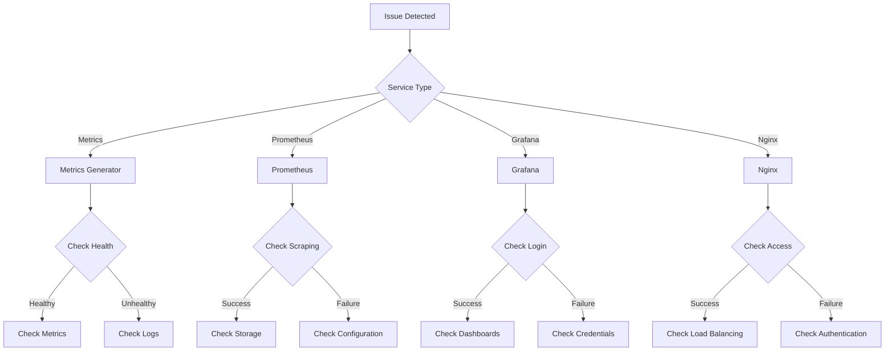
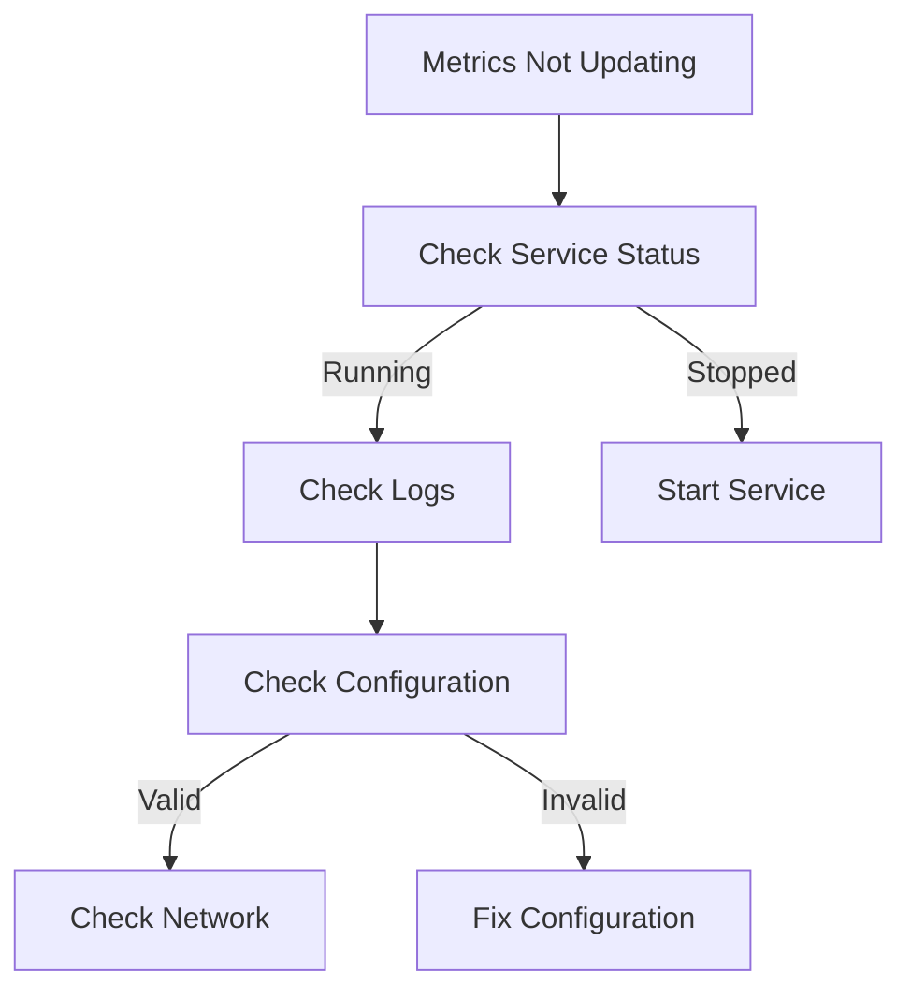
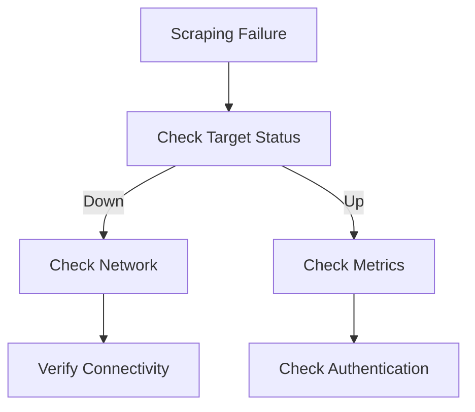
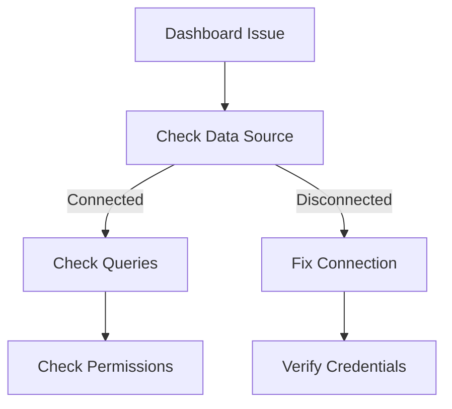
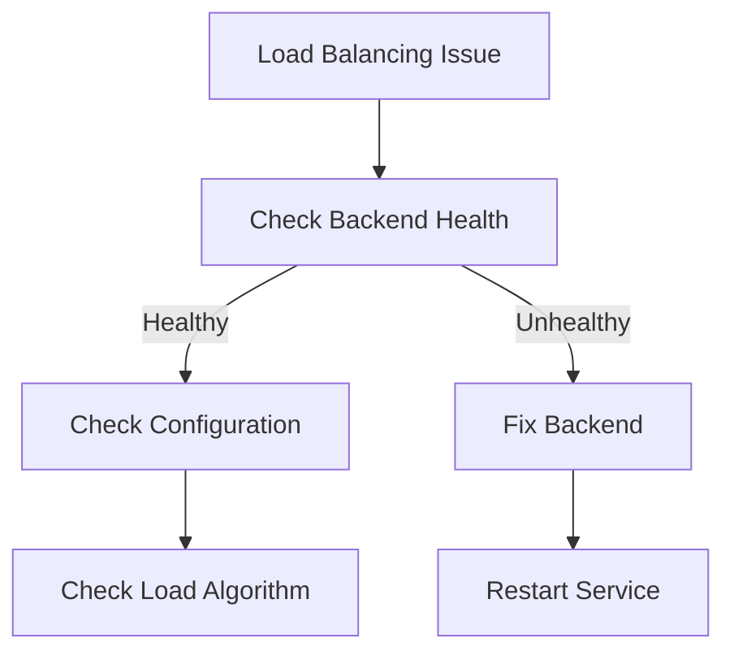
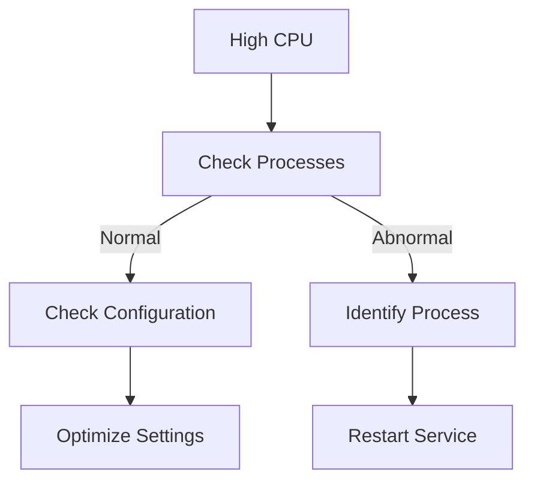
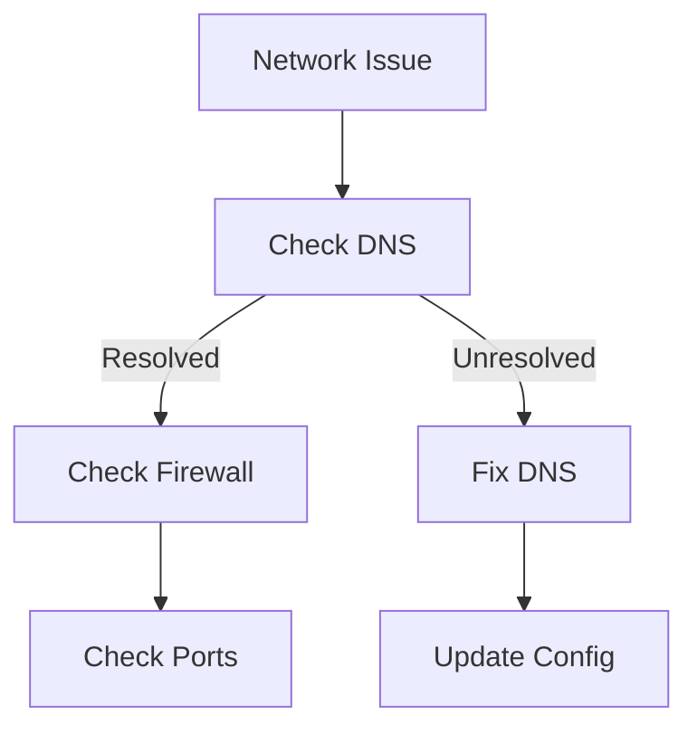

# Nessi Monitoring System Troubleshooting Guide

## Quick Reference Flowchart



## Common Issues and Solutions

### 1. Metrics Generator Issues

#### Issue: Metrics Not Updating


**Symptoms:**
- Metrics remain static
- No new data points
- Timestamps not updating

**Solutions:**
1. Check service status:
   ```bash
   docker-compose -f docker-compose.test.yml ps metrics-test
   ```

2. View logs:
   ```bash
   docker-compose -f docker-compose.test.yml logs metrics-test
   ```

3. Verify configuration:
   - Check environment variables
   - Verify scenario setting
   - Confirm interval timing

#### Issue: Authentication Failures
**Symptoms:**
- 401 Unauthorized errors
- Authentication prompts
- Access denied messages

**Solutions:**
1. Verify credentials:
   ```bash
   echo $METRICS_USERNAME
   echo $METRICS_PASSWORD
   ```

2. Check Nginx configuration:
   ```bash
   docker-compose -f docker-compose.test.yml exec nginx nginx -t
   ```

3. Verify .htpasswd file:
   ```bash
   docker-compose -f docker-compose.test.yml exec nginx cat /etc/nginx/.htpasswd
   ```

### 2. Prometheus Issues

#### Issue: Scraping Failures


**Symptoms:**
- Targets showing as down
- No metrics collected
- Scrape errors in logs

**Solutions:**
1. Check target status:
   ```bash
   curl http://localhost:9090/api/v1/targets
   ```

2. Verify network connectivity:
   ```bash
   docker-compose -f docker-compose.test.yml exec prometheus ping metrics-test
   ```

3. Check scrape configuration:
   ```bash
   docker-compose -f docker-compose.test.yml exec prometheus cat /etc/prometheus/prometheus.yml
   ```

#### Issue: Storage Problems
**Symptoms:**
- Disk full errors
- Corrupted data
- Query timeouts

**Solutions:**
1. Check disk usage:
   ```bash
   docker-compose -f docker-compose.test.yml exec prometheus df -h
   ```

2. Verify retention settings:
   ```bash
   docker-compose -f docker-compose.test.yml exec prometheus prometheus --config.file=/etc/prometheus/prometheus.yml --storage.tsdb.retention.time=15d
   ```

3. Compact storage:
   ```bash
   docker-compose -f docker-compose.test.yml exec prometheus prometheus --config.file=/etc/prometheus/prometheus.yml --storage.tsdb.retention.time=15d --storage.tsdb.path=/prometheus
   ```

### 3. Grafana Issues

#### Issue: Dashboard Problems


**Symptoms:**
- Empty dashboards
- Query errors
- Missing data

**Solutions:**
1. Verify data source:
   - Check connection status
   - Test connection
   - Verify credentials

2. Check dashboard configuration:
   - Review panel queries
   - Verify time ranges
   - Check variables

3. Verify permissions:
   - Check user roles
   - Verify folder permissions
   - Confirm dashboard access

#### Issue: Login Problems
**Symptoms:**
- Login failures
- Session timeouts
- Access denied

**Solutions:**
1. Reset admin password:
   ```bash
   docker-compose -f docker-compose.test.yml exec grafana grafana-cli admin reset-admin-password newpassword
   ```

2. Check user configuration:
   ```bash
   docker-compose -f docker-compose.test.yml exec grafana cat /etc/grafana/grafana.ini
   ```

3. Verify session settings:
   - Check cookie settings
   - Verify session timeout
   - Confirm authentication method

### 4. Nginx Issues

#### Issue: Load Balancing Problems


**Symptoms:**
- Uneven load distribution
- Connection timeouts
- Backend errors

**Solutions:**
1. Check backend health:
   ```bash
   curl -I http://localhost:8001/health
   ```

2. Verify load balancing:
   ```bash
   docker-compose -f docker-compose.test.yml exec nginx nginx -T
   ```

3. Monitor connections:
   ```bash
   docker-compose -f docker-compose.test.yml exec nginx nginx -s reload
   ```

#### Issue: Rate Limiting
**Symptoms:**
- 429 Too Many Requests
- Slow responses
- Connection drops

**Solutions:**
1. Check rate limit settings:
   ```bash
   docker-compose -f docker-compose.test.yml exec nginx cat /etc/nginx/nginx.conf
   ```

2. Monitor request rates:
   ```bash
   docker-compose -f docker-compose.test.yml exec nginx nginx -s reopen
   ```

3. Adjust limits:
   - Modify rate limit zone
   - Update burst settings
   - Configure delay

## System Resource Monitoring

### CPU Usage


**Monitoring:**
```bash
docker stats
```

**Solutions:**
1. Adjust resource limits
2. Optimize configurations
3. Scale services

### Memory Usage
**Monitoring:**
```bash
docker stats --format "table {{.Name}}\t{{.MemUsage}}"
```

**Solutions:**
1. Increase memory limits
2. Optimize cache settings
3. Clean up old data

### Disk Usage
**Monitoring:**
```bash
docker system df
```

**Solutions:**
1. Clean up unused volumes
2. Adjust retention policies
3. Increase storage capacity

## Network Troubleshooting

### Connectivity Issues


**Diagnostics:**
```bash
docker-compose -f docker-compose.test.yml exec prometheus ping metrics-test
```

**Solutions:**
1. Verify network configuration
2. Check firewall rules
3. Test port accessibility

### Performance Issues
**Diagnostics:**
```bash
docker-compose -f docker-compose.test.yml exec nginx nginx -T
```

**Solutions:**
1. Optimize network settings
2. Adjust buffer sizes
3. Configure keepalive

## Log Management

### Accessing Logs
```bash
# All services
docker-compose -f docker-compose.test.yml logs

# Specific service
docker-compose -f docker-compose.test.yml logs metrics-test

# Follow logs
docker-compose -f docker-compose.test.yml logs -f
```

### Log Rotation
**Configuration:**
```bash
docker-compose -f docker-compose.test.yml exec nginx logrotate /etc/logrotate.conf
```

**Solutions:**
1. Configure log rotation
2. Set retention policies
3. Monitor log sizes

## Backup and Recovery

### Configuration Backup
```bash
# Backup configurations
tar -czf config_backup.tar.gz prometheus.yml nginx.conf docker-compose.test.yml

# Backup data
docker-compose -f docker-compose.test.yml exec prometheus tar -czf /prometheus_data.tar.gz /prometheus
```

### Recovery Procedures
1. Restore configurations
2. Recover data volumes
3. Verify service health

## Security Issues

### Authentication Problems
**Diagnostics:**
```bash
# Check auth logs
docker-compose -f docker-compose.test.yml logs | grep -i auth

# Verify certificates
docker-compose -f docker-compose.test.yml exec nginx openssl x509 -in /etc/nginx/ssl/cert.pem -text -noout
```

**Solutions:**
1. Reset credentials
2. Update certificates
3. Review access logs

### Access Control
**Diagnostics:**
```bash
# Check permissions
docker-compose -f docker-compose.test.yml exec grafana ls -la /var/lib/grafana

# Verify firewall
docker-compose -f docker-compose.test.yml exec nginx iptables -L
```

**Solutions:**
1. Update permissions
2. Configure firewall
3. Review access policies 